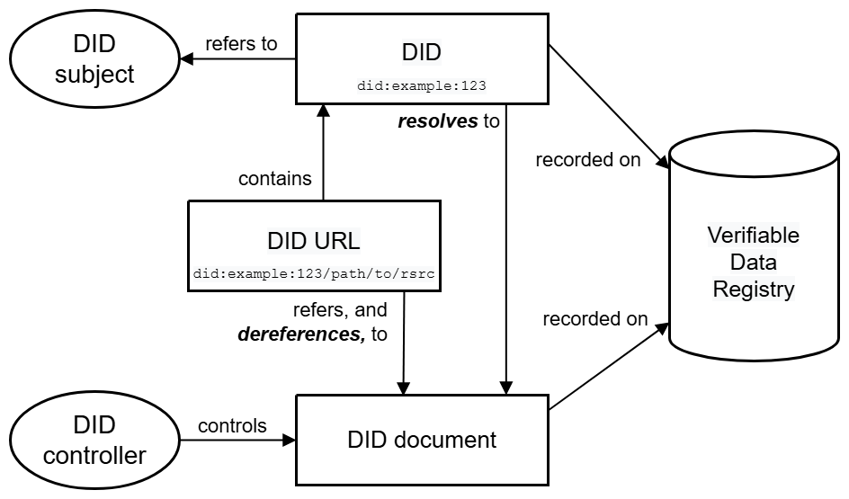

## DID architecture overview

This section provides a basic overview of the major components of Decentralized Identifier architecture.

### DIDs and DID URLs
A Decentralized Identifier, or DID, is a URI composed of three parts: the scheme did:, a method identifier, and a unique, method-specific identifier specified by the DID method. DIDs are resolvable to DID documents. A DID URL extends the syntax of a basic DID to incorporate other standard URI components such as path, query, and fragment in order to locate a particular resource—for example, a cryptographic public key inside a DID document, or a resource external to the DID document. 

### DID subjects
The subject of a DID is, by definition, the entity identified by the DID. The DID subject might also be the DID controller. Anything can be the subject of a DID: person, group, organization, thing, or concept.

### DID controllers
The controller of a DID is the entity (person, organization, or autonomous software) that has the capability—as defined by a DID method—to make changes to a DID document. This capability is typically asserted by the control of a set of cryptographic keys used by software acting on behalf of the controller, though it might also be asserted via other mechanisms. Note that a DID might have more than one controller, and the DID subject can be the DID controller, or one of them. 

### Verifiable data registries
In order to be resolvable to DID documents, DIDs are typically recorded on an underlying system or network of some kind. Regardless of the specific technology used, any such system that supports recording DIDs and returning data necessary to produce DID documents is called a verifiable data registry. Examples include distributed ledgers, decentralized file systems, databases of any kind, peer-to-peer networks, and other forms of trusted data storage.

### DID documents
DID documents contain information associated with a DID. They typically express verification methods, such as cryptographic public keys, and services relevant to interactions with the DID subject.

### DID methods
DID methods are the mechanism by which a particular type of DID and its associated DID document are created, resolved, updated, and deactivated.

### DID resolvers and DID resolution
A DID resolver is a system component that takes a DID as input and produces a conforming DID document as output. This process is called DID resolution. The steps for resolving a specific type of DID are defined by the relevant DID method specification. 

### DID URL dereferencers and DID URL dereferencing
A DID URL dereferencer is a system component that takes a DID URL as input and produces a resource as output. This process is called DID URL dereferencing.

